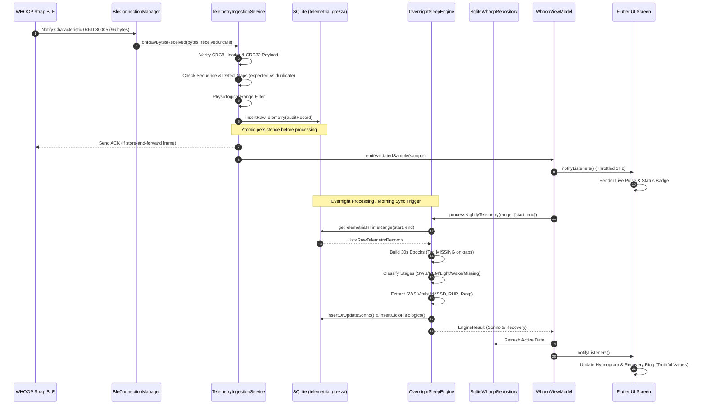

# WHOOP CLONE — DATA PIPELINE SPECIFICATION (PHASE 0)

> **Document Version:** 1.0.0  
> **Date:** October 2026  
> **Status:** ARCHITECTURAL SPECIFICATION & CONTRACT  
> **Scope:** End-to-End Pipeline Contract from BLE Antenna to UI Presentation

---

## 1. Pipeline Architecture Overview

The WHOOP Clone data ingestion and processing pipeline guarantees that every metric displayed on the screen originates from real device measurements, with complete provenance, sequence accountability, and cryptographic verification.

```
┌────────────────────────┐
│   WHOOP BLE HARDWARE   │ (PPG Optical, 3-Axis Accel, Skin Temp AS6221, SpO2 R-Ratio)
└───────────┬────────────┘
            │ BLE GATT Notifications (0x2A37 / 0x61080005)
            ▼
┌────────────────────────┐
│  BleConnectionManager  │ (Discrete States: CONNECTING -> STREAMING / SYNCING_HISTORY)
└───────────┬────────────┘
            │ Raw bytes stream [List<int>]
            ▼
┌────────────────────────┐
│TelemetryIngestionServ. │ 1. Reception Timestamping (UTC ms)
│                        │ 2. Framing & CRC8/16/32 Validation
│                        │ 3. Sequence Tracking & Gap Analysis (wraparound, missing, ooo)
│                        │ 4. Deduplication Filter (hash / seq cache)
│                        │ 5. Physiological Boundary Validation
└───────────┬────────────┘
            │ Validated Ingestion Frame
            ▼
┌────────────────────────┐
│   SQLite Persistence   │ Single Source of Truth: `telemetria_grezza`
│   (DatabaseHelper)     │ Audit Columns: device_id, seq, crc_valid, raw_payload, quality
└───────────┬────────────┘
            │ Transaction Commit & History Query
            ▼
┌────────────────────────┐
│ OvernightSleepEngine / │ 1. 30s Epoch Aggregation (sampleCount >= 10, valid/missing)
│ Analytics Engines      │ 2. Stage Classification (SWS, REM, Light, Wake, MISSING)
│                        │ 3. Vitals Extraction (SWS-filtered rMSSD, RHR, RSA Resp Rate)
│                        │ 4. 30-Day Rolling Baseline & Z-Score Recovery Calculation
└───────────┬────────────┘
            │ Typed Domain Models: Sonno, CicloFisiologico, UtenteProfilo
            ▼
┌────────────────────────┐
│ Repositories & VM      │ Reactive Streams (watchDailyCycle, watchSleep, watchProfile)
│ (WhoopViewModel)       │ Throttled UI State Emission (max 1-2 Hz, change-filtered)
└───────────┬────────────┘
            │ Immutable State Binding
            ▼
┌────────────────────────┐
│  Presentation Layer    │ Truthful UI: Metric Cards, Hypnogram, Tri-Ring Dial
│  (Flutter Widgets)     │ States: [REAL_MEASUREMENT], [USER_ENTERED], [NO DATA / --]
└────────────────────────┘
```

---

## 2. Detailed Pipeline Stages & Data Contracts

### STAGE 1: BLE Hardware & Characteristic Discovery
* **Protocol:** Bluetooth Low Energy (BLE 4.2 / 5.0) via GATT.
* **Services & Characteristics:**
  1. Standard Heart Rate Service: `0x180D` $\to$ Characteristic `0x2A37` (Notify, 1 Hz).
  2. WHOOP Proprietary Service: `61080001-8d6d-82b8-614a-1c8cb0f8dcc6`
     - Command / Tx: `61080002-...`
     - Ack: `61080003-...`
     - Telemetry Rx (96-Byte): `61080005-...`
* **Input:** Raw radio packets transferred over L2CAP / ATT notification.
* **Rejection Criteria:**
  - Device disconnected.
  - GATT discovery timeout ($> 15\text{s}$).
  - Characteristic subscription CCCD failure.
* **Output:** Byte streams `Stream<List<int>>`.

---

### STAGE 2: Framing & Packet Decoding
* **Decoders:** `Whoop96BytePacket`, `HrDataPacket`, `NoopProtocolDecoder`.
* **Framing Formats Supported:**
  1. **Whoop Framed Packet (`0xAA` Sync Header):**
     - Byte 0: `0xAA` (Sync)
     - Bytes 1–2: Payload Length (`uint16 LE`)
     - Byte 3: Header CRC8 (`WhoopCrc8`, poly `0x07`)
     - Bytes 4–7: Device Timestamp UTC (`uint32 LE`)
     - Byte 8: Heart Rate BPM (`uint8`)
     - Bytes 9–10: HRV $rMSSD \times 10$ (`uint16 LE`)
     - Bytes 11–16: Triaxial Accelerometer ($X, Y, Z$ in $10^{-3} g$, `int16 LE`)
     - Byte 17: Skin Temperature Normalized (`int8`)
     - Bytes 18–19: Respiratory Metric / PPG Ratio
     - Trailing 4 Bytes: Payload CRC32 (`WhoopCrc32`)
  2. **Flat 96-Byte Telemetry Packet:**
     - Bytes 0–1: Sequence Number (`uint16 LE`)
     - Byte 4: Heart Rate BPM (`uint8`)
     - Bytes 8–11: Motion Variance / ENMO (`float32 LE`)
     - Bytes 16–19: Respiratory Power RSA (`float32 LE`)
     - Bytes 20–23: Respiratory Rate (`float32 LE`)
     - Bytes 28–29: Raw Temperature AS6221 (`uint16 LE`)
     - Bytes 32–35: SpO2 PPG R-Ratio (`float32 LE`)
     - Bytes 40–43: Native HRV $rMSSD$ ms (`float32 LE`)
* **Rejection Criteria:**
  - Byte length $< 20$ bytes.
  - Sync byte mismatch (neither `0xAA` nor standard length).
  - CRC8 header corruption or CRC32 payload mismatch.

---

### STAGE 3: Sequence Tracking, Gap Detection & Deduplication
* **Component:** `TelemetryIngestionService`
* **Internal State Tracked:**
  - `int? _lastSequenceNumber` (0–65535, with 16-bit wraparound handling)
  - `int _packetsReceived`
  - `int _packetsSaved`
  - `int _packetsDuplicate`
  - `int _packetsInvalid`
  - `int _packetsMissing`
  - `Set<String> _recentPacketSignatures` (Sliding window of last 500 signatures)
* **Classification Logic:**
  - **DUPLICATE:** Incoming `sequenceNumber == _lastSequenceNumber` OR signature hash already present in sliding window $\to$ discard from database, increment `packetsDuplicate`.
  - **EXPECTED:** Incoming `sequenceNumber == (_lastSequenceNumber + 1) % 65536`.
  - **GAP / MISSING:** Incoming `sequenceNumber > (_lastSequenceNumber + 1)` $\to$ compute gap:
    $$\Delta_{\text{missing}} = (seq_{\text{in}} - seq_{\text{last}} - 1) \pmod{65536}$$
    Increment `packetsMissing += \Delta_{\text{missing}}`. Log telemetry gap event with start and end sequence numbers.
  - **OUT_OF_ORDER:** Packet sequence belongs to a known historical fill window $\to$ mark source as `STORE_AND_FORWARD`.

---

### STAGE 4: Physiological Validation & Quality Gates
Every decoded value is passed through strict physiological sanity boundaries:

| Metric | Valid Physiological Range | Action if Out of Range |
|---|---|---|
| **Heart Rate** | $30 \le \text{BPM} \le 220$ | Discard BPM / mark record `lowConfidence` |
| **RR Interval** | $300 \le \text{RR} \le 1500\text{ ms}$ | Filter individual interval artifact |
| **rMSSD (HRV)** | $5.0 \le rMSSD \le 250.0\text{ ms}$ | Set to `NULL`, never inject fake 65 ms |
| **ENMO Acceleration** | $0.0 \le \text{ENMO} \le 16.0\text{ g}$ | Clamp or mark saturated |
| **Skin Temperature** | $25.0 \le T \le 42.0\text{ }^\circ\text{C}$ | Set to `NULL`, never inject 36.5 |
| **$\text{SpO}_2$** | $70.0 \le \text{SpO}_2 \le 100.0\%$ | Set to `NULL` |
| **Respiration Rate** | $6.0 \le \text{RPM} \le 35.0$ | Set to `NULL` |

**Zero Fallback Rule:** If a sensor measurement fails the validation gate, the stored value must be `NULL`.

---

### STAGE 5: SQLite Persistence (`telemetria_grezza`)
* **Schema Upgrade (Version 15):**
  ```sql
  CREATE TABLE telemetria_grezza (
    id INTEGER PRIMARY KEY AUTOINCREMENT,
    timestamp TEXT NOT NULL,
    timestamp_utc_ms INTEGER NOT NULL,
    device_id TEXT,
    session_id TEXT,
    sequence_number INTEGER,
    packet_type TEXT NOT NULL,
    raw_payload BLOB,
    decoder_version TEXT NOT NULL,
    crc_valid INTEGER NOT NULL DEFAULT 1,
    is_valid INTEGER NOT NULL DEFAULT 1,
    received_at TEXT NOT NULL,
    device_timestamp TEXT,
    ingest_latency_ms INTEGER,
    duplicate INTEGER NOT NULL DEFAULT 0,
    source TEXT NOT NULL, -- 'REAL_MEASUREMENT', 'STORE_AND_FORWARD', 'MANUAL'
    quality TEXT NOT NULL, -- 'VALID', 'LOW_CONFIDENCE', 'CORRUPT'
    bpm INTEGER,
    rr_ms REAL, -- Raw representative RR interval
    rmssd_ms REAL, -- Dedicated column for true rMSSD
    rr_intervals_json TEXT,
    accel_enmo REAL,
    motion_var REAL,
    skin_temp_celsius REAL,
    skin_temp_raw INTEGER,
    spo2_pct REAL,
    spo2_ratio_r REAL,
    resp_rate REAL,
    resp_power REAL
  );
  ```
* **Indices:**
  - `idx_telemetria_utc ON telemetria_grezza (timestamp_utc_ms)`
  - `idx_telemetria_seq ON telemetria_grezza (sequence_number)`
  - `idx_telemetria_device ON telemetria_grezza (device_id)`

---

### STAGE 6: Aggregation & 30-Second Epoch Formation
* **Component:** `OvernightSleepEngine._buildEpochs30s`
* **Time Windows:** Fixed non-overlapping 30-second bins: $[t_0, t_0 + 30\text{s})$.
* **Epoch Data Contract:**
  ```dart
  class Epoch30s {
    final DateTime timestamp;
    final int sampleCount;
    final double? hr;
    final double? rmssd;
    final double? enmo;
    final double? motionVar;
    final double? respPower;
    final double? respRate;
    final SleepStage stage;
    final EpochQuality quality; // VALID, LOW_CONFIDENCE, MISSING
    final String source; // REAL_MEASUREMENT, STORE_AND_FORWARD
  }
  ```
* **Missing Epoch Handling:**
  - If `sampleCount == 0`:
    - `stage = SleepStage.missing` (NEVER `SleepStage.light`!)
    - `quality = EpochQuality.missing`
    - `hr = null`, `rmssd = null`, `enmo = null`
  - If `sampleCount < 10`:
    - `quality = EpochQuality.lowConfidence`

---

### STAGE 7: Sleep Staging & Vitals Extraction
* **Stages Classified:**
  - `SleepStage.awake`: $\text{motionVar} > 0.040\text{ g}$ or $\text{HR} > \text{RHR}_{\text{base}} + 12$.
  - `SleepStage.sws` (Deep Sleep): $\text{motionVar} < 0.015\text{ g}$ and $\text{HR} < \text{RHR}_{\text{base}} + 4$ and stable low $rMSSD$ variance.
  - `SleepStage.rem`: Atonia ($\text{enmo} < 0.010\text{ g}$), high $rMSSD$ variance, autonomic heart rate oscillations.
  - `SleepStage.light`: Quiet sleep not qualifying for SWS or REM.
  - `SleepStage.missing`: Gaps with zero telemetry data.
* **Vitals Extraction Rules:**
  - Nocturnal $RHR$: Minimum 10th percentile of HR during verified SWS epochs. If no SWS, minimum during quiet epochs. If zero valid epochs: `NULL`.
  - Nocturnal $HRV$ ($rMSSD$): Median of $rMSSD$ strictly during verified SWS epochs. If zero valid SWS epochs: `NULL`.
  - Respiratory Rate: Median of spectral peak or RSA frequency during calm sleep.

---

### STAGE 8: Baseline Calibration & Recovery Engine
* **Cold Start vs Normal Operation:**
  - **Cold Start ($0 \le \text{days} < 4$):** Baseline is marked `isCalibrating: true`. UI displays "Calibrating ($N/4$ days)".
  - **Bootstrap ($4 \le \text{days} < 30$):** Progressive rolling mean and standard deviation.
  - **Regime ($\text{days} \ge 30$):** Full 30-day window ($\mu, \sigma$).
* **Recovery Formula Contract:**
  $$z_{\text{HRV}} = \frac{\ln(rMSSD) - \mu_{\ln}}{\sigma_{\ln}}, \quad z_{\text{RHR}} = \frac{\mu_{\text{RHR}} - RHR_{\text{sws}}}{\sigma_{\text{RHR}}}$$
  $$Z_{\text{tot}} = 0.45 \cdot z_{\text{HRV}} + 0.30 \cdot z_{\text{RHR}} + 0.15 \cdot \left(\frac{\text{SleepPerf} - 70}{15}\right)$$
  $$\text{Score} = \text{clamp}\left( \left(\frac{Z_{\text{tot}} + 3.0}{6.0} \cdot 100\right) - \text{Penalties}, \ 1.0, \ 99.0 \right)$$
* **Missing Vitals Gate:**
  If $rMSSD$ is `NULL` or $RHR$ is `NULL`, recovery score cannot be computed: return `recoveryScore = null`, zone = `null`.

---

### STAGE 9: Reactive ViewModel & UI Binding
* **Contract:**
  - UI never computes physiology; it only binds to ViewModel.
  - Live frame updates throttled to a maximum frequency of $1\text{ Hz}$ to prevent widget tree churn.
  - Every metric widget displays:
    1. Numerical value or `"--"` / `"No Data"`.
    2. Unit of measurement.
    3. Provenance badge: `REAL_MEASUREMENT`, `STORE_AND_FORWARD`, `USER_ENTERED`, `ESTIMATED`.
    4. Calibration or Missing state indicator.

---

## 3. Telemetry Pipeline Sequence Diagram



---

## 4. Pipeline Integrity Diagnostics Contract

The `TelemetryIngestionService` exposes real-time diagnostics:
```dart
class IngestionDiagnostics {
  final int totalPacketsReceived;
  final int totalPacketsSaved;
  final int totalDuplicatesDetected;
  final int totalCrcFailures;
  final int totalSequenceGaps;
  final int totalPacketsMissing;
  final double packetLossRatePct;
  final double averageIngestLatencyMs;
}
```
These metrics allow instant verification whether missing data occurred at the radio layer (strap not sending) or at the application layer.
