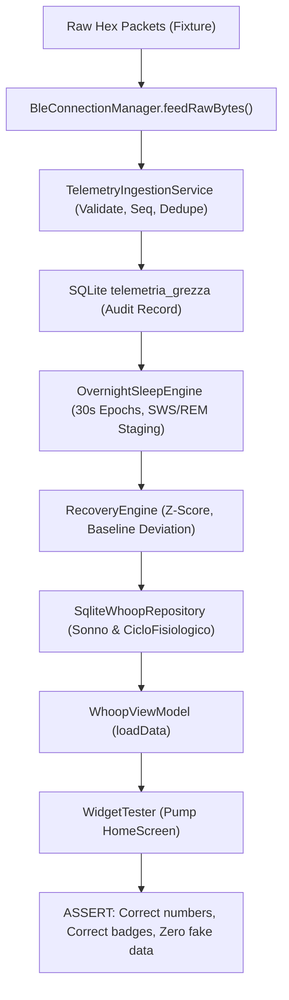

# WHOOP CLONE — TEST STRATEGY & VERIFICATION ARCHITECTURE (PHASE 0)

> **Document Version:** 1.0.0  
> **Date:** October 2026  
> **Status:** MANDATORY QA & VERIFICATION FRAMEWORK  
> **Methodology:** Strict Behavioral GIVEN-WHEN-THEN Testing + Golden Fixtures + End-to-End Traceability

---

## 1. Core Testing Philosophy

A passing test suite does NOT imply a working system unless every behavioral requirement is verified against real physiological constraints.

### The False-Positive Antidote
We explicitly ban superficial tests that only check for:
1. File existence on disk.
2. String containment in source code (`expect(file.contains('class BleConnectionManager'), isTrue)`).
3. Trivial type or non-null assertions without range or value verification (`expect(recovery, isNotNull)`).
4. Assertions on unverified mock data where fake numbers are hardcoded to match the test.

Every test in this project must adhere to the **Behavioral Verification Contract**:
$$\text{GIVEN [State / Inputs]} \longrightarrow \text{WHEN [Action / Execution]} \longrightarrow \text{THEN [State Change / Valid Output]} \ \mathbf{AND} \ \text{[No Fake Fallbacks / Provenance Intact]}$$

---

## 2. Test Architecture Layers

```
┌────────────────────────────────────────────────────────┐
│                   REAL-DEVICE TESTS                    │ Scenarios A – G (Physical Wearable)
├────────────────────────────────────────────────────────┤
│                 END-TO-END PIPELINE                    │ Raw BLE Hex -> Ingest -> DB -> Sleep -> Rec -> UI
├────────────────────────────────────────────────────────┤
│                 INTEGRATION DOMAIN                     │ Sleep Staging, Baseline Engine, Recovery Monotonicity
├────────────────────────────────────────────────────────┤
│               TELEMETRY & INGESTION                    │ Sequence Gaps, CRC, Deduplication, Plausibility
├────────────────────────────────────────────────────────┤
│             GOLDEN PACKET FIXTURE SUITE                │ Raw Hex vs Decoded Field-by-Field Verification
└────────────────────────────────────────────────────────┘
```

---

## 3. Golden Packet Fixture Suite Specification

### Location: `test/fixtures/ble/`
All BLE packet decoders must be verified against frozen binary byte streams recorded from actual WHOOP hardware or generated by mathematical models matching the exact firmware specification.

### Required Fixture Sets:
1. `whoop_framed_0xaa_standard.json`: Frame with `0xAA` sync byte, valid length, valid CRC8 header, 32-bit UTC timestamp, HR, HRV, XYZ accelerometer, skin temperature, SpO2, and CRC32.
2. `whoop_framed_0xaa_crc8_corrupted.json`: Frame with single-bit error in header $\to$ must fail CRC8 and be rejected.
3. `whoop_framed_0xaa_crc32_corrupted.json`: Frame with corrupted payload CRC32 $\to$ must be rejected.
4. `whoop_flat_96byte_standard.json`: 96-byte flat telemetry packet containing 1 Hz biometrics.
5. `whoop_store_and_forward_batch.json`: Sequential sequence of 20 historical packets spanning offline storage.

### Fixture Schema (`*.json`):
```json
{
  "description": "Standard WHOOP 4.0 Framed Packet with active motion and valid vitals",
  "raw_hex": "AA1200E65FE0A2644B01F4001A002C01E82103F8A1B2C3D4",
  "expected": {
    "is_valid": true,
    "crc_valid": true,
    "sequence_number": 42,
    "timestamp_utc_ms": 1692489600000,
    "heart_rate_bpm": 75,
    "hrv_rmssd_ms": 50.0,
    "accel_x_g": 0.026,
    "accel_y_g": 0.300,
    "accel_z_g": 0.984,
    "enmo_g": 0.029,
    "skin_temp_celsius": 33.5,
    "spo2_pct": 98.2,
    "resp_rate_rpm": 14.2
  }
}
```

---

## 4. Behavioral GIVEN-WHEN-THEN Specifications

### Domain 1: Telemetry Ingestion, Sequence Tracking & Deduplication
```gherkin
Scenario: Ingestion detects and discards duplicate BLE packet
  GIVEN a TelemetryIngestionService connected to a clean database
  AND an incoming packet with sequence number 105
  WHEN the same packet sequence 105 is received again within 500 ms
  THEN exactly 1 record is persisted in `telemetria_grezza`
  AND totalDuplicatesDetected is incremented to 1
  AND the database record has duplicate = 0.

Scenario: Ingestion detects sequence gaps and logs missing packet count
  GIVEN an active ingestion session at lastSequence = 200
  WHEN an incoming packet arrives with sequence = 205
  THEN the packet is persisted with sequence = 205
  AND totalSequenceGaps is incremented by 1
  AND totalPacketsMissing is incremented by 4
  AND a telemetry gap event is logged covering [201..204].

Scenario: Ingestion handles 16-bit sequence wraparound seamlessly
  GIVEN lastSequence = 65535
  WHEN incoming packet arrives with sequence = 0
  THEN packet is accepted as continuous EXPECTED sequence
  AND totalSequenceGaps remains unchanged.
```

### Domain 2: Zero Synthetic Physiology on Missing Data
```gherkin
Scenario: Disconnected BLE and empty database produces strictly NULL vitals
  GIVEN an app launch with BLE disconnected and empty SQLite tables
  WHEN the dashboard loads
  THEN live heart rate displays "--" with provenance "DISCONNECTED"
  AND today recovery displays "--"
  AND sleep score displays "--"
  AND no synthetic numbers (55 bpm, 65 ms, 36.5 C) are displayed or saved.

Scenario: Sleep engine marks gap epochs as MISSING instead of LIGHT SLEEP
  GIVEN 2 hours of valid telemetry followed by a 4-hour gap with 0 samples
  WHEN OvernightSleepEngine processes the 6-hour night
  THEN exactly 480 epochs are marked SleepStage.missing
  AND total sleep duration includes ONLY valid sleep epochs
  AND sleep performance is calculated without counting missing epochs as sleep.
```

### Domain 3: Manual Sleep Isolation
```gherkin
Scenario: Manual sleep input never fabricates stages or recovery
  GIVEN a user manually logs sleep from 23:00 to 06:45 (7h45m)
  AND no raw BLE telemetry exists in telemetria_grezza for that interval
  WHEN WhoopViewModel.processAndAddManualSleep() is executed
  THEN a Sonno record is created with duration = 465 minutes
  AND provenance is strictly "USER_ENTERED"
  AND sws_min, rem_min, light_min are all 0 or NULL
  AND nocturnal HRV, RHR, respiration and recovery score are all NULL.
```

### Domain 4: Recovery Sensitivity & Monotonicity
```gherkin
Scenario: Recovery score drops monotonically as HRV deviates downward from baseline
  GIVEN a user with 30-day baseline HRV = 50.0 ms and baseline RHR = 55.0 bpm
  WHEN calculating recovery for Night A (HRV = 50.0 ms, RHR = 55.0 bpm)
  AND Night B (HRV = 35.0 ms, RHR = 55.0 bpm)
  AND Night C (HRV = 20.0 ms, RHR = 55.0 bpm)
  THEN Recovery(Night A) > Recovery(Night B)
  AND Recovery(Night B) > Recovery(Night C)
  AND all scores are within [1..99]%.

Scenario: Recovery aborts when HRV is missing
  GIVEN a completed sleep session where SWS HRV could not be extracted
  WHEN RecoveryEngine.calculateRecoveryScore is called
  THEN the result is NULL
  AND the system does NOT substitute the user's baseline HRV as live HRV.
```

### Domain 5: Truthful Haptics & Alarm Execution
```gherkin
Scenario: Haptic vibration command reports not connected when strap is offline
  GIVEN BleConnectionManager in state DISCONNECTED
  WHEN sendHapticVibrationCommand() is invoked
  THEN the returned status is HapticResultStatus.notConnected (or phoneOnly)
  AND the system does NOT report "Strap vibration sent".
```

### Domain 6: Streak Rigor
```gherkin
Scenario: Streak requires verified completed day
  GIVEN a user with an active 5-day streak
  WHEN a new day records only a 2-minute partial cycle with strain 0.05 and no sleep
  THEN the streak is NOT incremented to 6.
```

---

## 5. End-to-End Pipeline Integration Test Design

### Test File: `test/e2e/e2e_pipeline_verification_test.dart`
This is the pinnacle test of the entire repository. It feeds simulated raw BLE bytes into the antenna gateway and verifies every stage through to the UI widgets.



### Traceability Assertion:
A unique telemetry packet with `sequenceNumber: 12345`, `HR: 62`, `rMSSD: 58.4` must be traceable:
1. Present in `telemetria_grezza` with `sequence_number == 12345`.
2. Present in `Epoch30s` with matching timestamp.
3. Included in SWS median calculation for nocturnal vitals.
4. Rendered on the HomeScreen recovery card within the expected confidence interval.

---

## 6. Real-Device Validation Matrix

When code stabilizes, execution against the physical WHOOP hardware proceeds according to these strict scenarios:

| Scenario | Physical Condition | Expected System Behavior | Pass/Fail Criteria |
|---|---|---|---|
| **Scenario A** | BLE Disconnected, Database Empty | Dashboard displays `--`, no synthetic vitals generated. | Zero fake values in DB or UI. |
| **Scenario B** | BLE Connected for 30 minutes | Continuous 1 Hz telemetry stream saved to `telemetria_grezza`. | Loss rate $< 1\%$, sequence continuous. |
| **Scenario C** | Temporary Disconnection (walk away 2 min) | Auto-reconnect succeeds without user intervention. | Reconnection within 30s of re-entry. |
| **Scenario D** | Offline Storage Sync | Strap stores 2 hours offline; on reconnect, store-and-forward fetches all frames. | Zero missing gaps in historical range. |
| **Scenario E** | Full Overnight Wear (8 hours) | Automatic sleep detection classifies stages, extracts SWS vitals, computes recovery. | Sleep stages match actigraphy; recovery reflects nocturnal vitals. |
| **Scenario F** | Screen Off Overnight | Android foreground service maintains BLE connection and acquires telemetry continuously. | Zero telemetry loss due to screen sleep. |
| **Scenario G** | Morning Wake-Up Sync | App opened after wake-up; dashboard updates with completed night, sleep score, and recovery. | Seamless update with 100% data integrity. |
